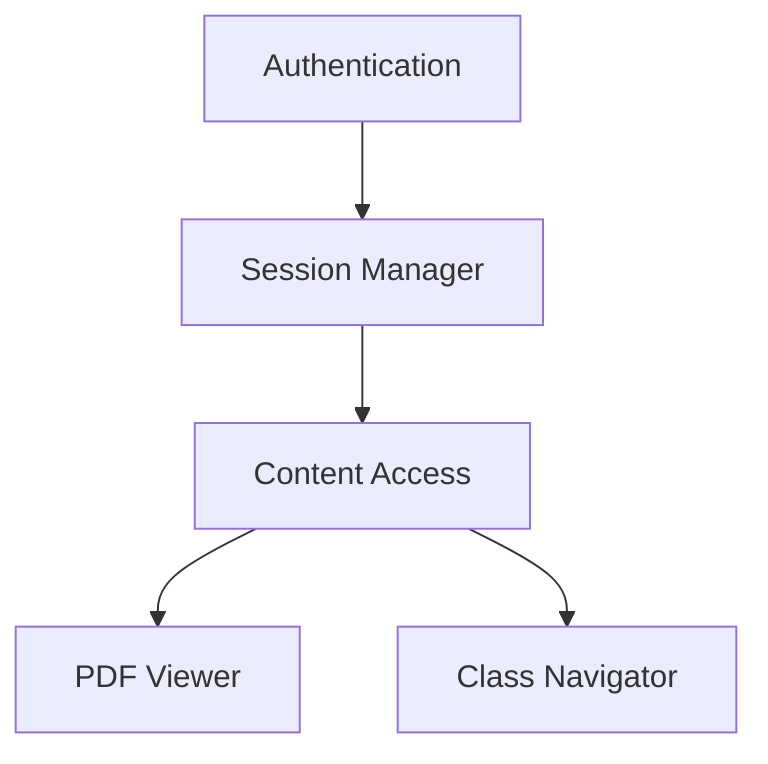

# System Patterns

## Architecture Overview
The application follows a simple single-page architecture with these main components:

1. Authentication Layer
   - Login form
   - Session management
   - Access control

2. Content Display Layer
   - Class selection interface
   - PDF viewer component
   - Navigation controls

## Design Patterns
1. Module Pattern
   - Separate authentication logic
   - Content management module
   - UI interaction handlers

2. Observer Pattern
   - Event listeners for user interactions
   - State changes monitoring

3. Factory Pattern
   - PDF viewer initialization
   - Content loader creation

## Component Relationships

## Security Considerations
1. Client-side authentication
2. PDF viewing restrictions
3. Session management
4. Content access control

## UI Design Patterns
### Responsive Layout Patterns
- Sử dụng Flexbox và Grid cho layout linh hoạt
- Container có max-width và margin auto để căn giữa nội dung
- Responsive images với object-fit
- Responsive typography với rem units
- Collapsible navigation menu trên mobile
- Stack layout trên mobile thay vì side-by-side
- Ẩn/hiện các thành phần UI dựa trên viewport size 